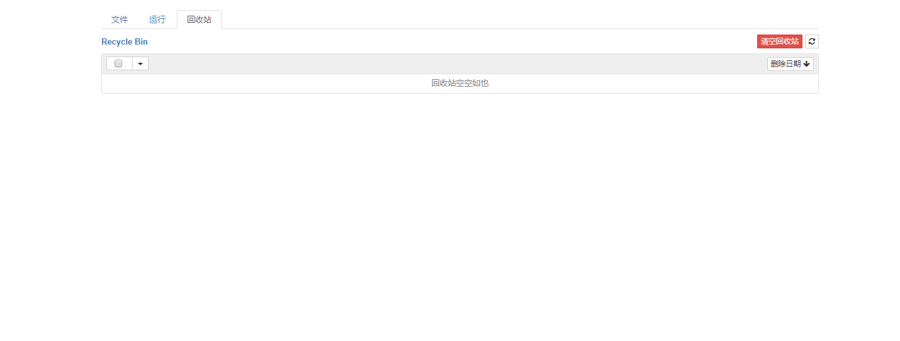

# nbtrash



NB Trash Tool (nbtrash) add recycle bin tab to notebook.

## Installation

You can currently install this package from PyPI.

```bash
pip install git+https://github.com/wixb50/nbtrash.git
```

**If your notebook version is < 5.3**, you need to enable the extension manually.

```
jupyter serverextension enable --py nbtrash --sys-prefix
jupyter nbextension install --py nbtrash --sys-prefix
jupyter nbextension enable --py nbtrash --sys-prefix
```

## Configuration

### Trash Dir

Default is `/home/jovyan/work/.Trash`,you can custom it by follow [send2trash](https://github.com/hsoft/send2trash).

**The work dir must the same device with trade dir.**
